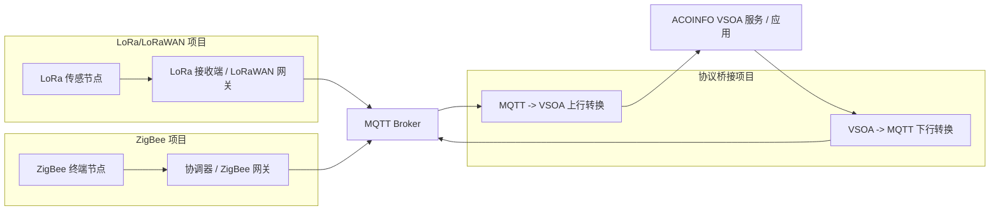

# 南航-ACOINFO 项目制实习物联网课程开发仓库

本仓库用于统一管理南京航空航天大学与南京翼辉信息技术有限公司（ACOINFO）项目制实习中的三个物联网方向项目，共包含 16 个课程实验。

仓库统一管理实验源码、配置、实验指导书、测试脚本、测试记录、运行日志、结果截图、汇报 PPT 和验收材料。所有实验应达到“可运行、可测试、可记录、可复现”的基本要求。

## 1. 项目总览

| 项目 | 目录 | 实验范围 | 主要内容 |
| --- | --- | --- | --- |
| 物联网传输协议桥接组件开发 | [`01_protocol_bridge/`](01_protocol_bridge/) | L5、L6、Z6 | MQTT 与 VSOA 数据转换、消息转发和接口适配 |
| 物联网 LoRa/LoRaWAN 应用案例开发 | [`02_lora_lorawan/`](02_lora_lorawan/) | L1-L4、L7-L8 | LoRa 通信、传感采集、LoRaWAN 接入和综合应用 |
| 物联网 ZigBee 应用案例开发 | [`03_zigbee/`](03_zigbee/) | Z1-Z5、Z7-Z8 | ZigBee 组网、数据采集、设备控制和工业应用 |

协议桥接项目中的 [`B00_common_framework/`](01_protocol_bridge/experiments/B00_common_framework/) 用于公共框架和跨组联调支撑，不计入 16 个正式实验。

## 2. 仓库结构

```text
nuaa_acoinfo_iot_internship_repo/
  01_protocol_bridge/   协议桥接项目
  02_lora_lorawan/      LoRa/LoRaWAN 项目
  03_zigbee/            ZigBee 项目
  common/
    assets/             三个项目共用素材
    templates/          README、指导书、PPT 和测试模板
    standards/          仓库结构和实验提交规范
    acceptance/         公共验收清单
  README.md             仓库总入口
```

每个项目使用统一的项目级结构：

```text
assets/       项目级图片和素材
config/       项目公共配置
docs/         项目设计和测试文档
examples/     示例数据
experiments/  本项目负责的实验
logs/         项目汇总日志
scripts/      项目公共脚本
src/          项目公共源码
tests/        项目级测试
README.md     项目入口说明
```

每个实验使用统一的实验级结构：

```text
experiments/{实验编号}_{实验名称}/
  README.md
  src/
  config/
  docs/
  slides/
  tests/
    logs/
  assets/
```

## 3. 系统架构

三个项目分别负责终端通信、数据接入和协议桥接，通过 MQTT 与 VSOA 形成完整的物联网数据链路。



上行流程：

1. LoRa 或 ZigBee 节点采集数据。
2. 接收端或网关将数据整理并发布到 MQTT Broker。
3. 协议桥接组件订阅 MQTT 消息，完成字段校验和格式转换。
4. 转换后的数据通过 VSOA 服务提供给上层应用。

下行流程：

1. VSOA 应用发出设备控制命令。
2. 协议桥接组件将命令转换为 MQTT topic 和 payload。
3. LoRa 或 ZigBee 网关接收 MQTT 消息并转发到目标设备。
4. 设备执行命令，并根据实验设计返回状态或执行结果。

各实验可以独立运行；L5、L6、Z6 需要与 LoRa 或 ZigBee 项目进行跨组联调。实际 topic、字段和 VSOA 接口以三个组确认后的接口文档为准。

## 4. 硬件与软件环境

### 4.1 公共软件环境

| 类别 | 建议工具 | 用途 |
| --- | --- | --- |
| 操作系统 | Windows 10/11 或项目支持的 Linux | 开发、构建和测试 |
| 版本管理 | Git、GitHub | 代码协作和版本管理 |
| 编辑器 | VS Code 或实验指定 IDE | 编辑代码和文档 |
| 文档工具 | Microsoft Word、PowerPoint、Markdown 预览器 | 指导书和汇报材料 |
| 测试工具 | Python、pytest 或实验原生测试工具 | 统一测试入口和结果检查 |
| MQTT 工具 | MQTTX、Mosquitto 客户端或项目指定工具 | 发布、订阅和观察 MQTT 消息 |
| 串口工具 | 实验指定串口终端 | 查看嵌入式设备日志 |

具体版本必须由实验负责人根据实际可运行环境填写在实验 README 中，不以本表代替实验环境记录。

### 4.2 各项目环境

| 项目 | 主要硬件 | 主要软件或协议 | 说明 |
| --- | --- | --- | --- |
| 协议桥接 | 不强制使用硬件 | MQTT Broker、MQTT 客户端、ACOINFO VSOA SDK/环境 | 纯软件实验可将硬件和烧录标记为“不适用” |
| LoRa/LoRaWAN | LoRa 开发板、LoRa 模块、传感器、LoRaWAN 网关等 | 对应芯片 SDK、烧录工具、串口工具、MQTT | 型号、频率和射频参数以实际设备为准 |
| ZigBee | ZigBee 开发板、协调器、路由器、终端、烧录器等 | 对应协议栈、IDE、烧录工具、串口工具、MQTT | 芯片型号、信道和 PAN ID 以实际实验为准 |

每个实验应在自己的 README 中记录设备型号、数量、SDK/IDE 版本、驱动、接线或网络连接方式。仓库总 README 不锁定某一种开发板或软件版本。

## 5. 配置说明

配置按“公共示例、项目公共配置、实验专用配置”分层管理：

| 位置 | 内容 | 使用原则 |
| --- | --- | --- |
| `common/templates/` | 配置说明格式和公共模板 | 只存模板，不存个人运行参数 |
| `{project}/config/` | 项目公共协议、服务或设备配置 | 多个实验共用时放在这里 |
| `{project}/experiments/{实验}/config/` | 单个实验专用配置 | 仅服务于本实验时放在这里 |
| `examples/` | 示例 payload、数据帧和演示输入 | 必须使用脱敏或模拟数据 |

重点配置项：

- 协议桥接：MQTT Broker 地址和端口、topic、QoS、payload 字段、VSOA 服务名、URL 和请求方式。
- LoRa/LoRaWAN：工作频率、带宽、扩频因子、编码率、发射功率、节点标识、网关和 MQTT 参数。
- ZigBee：信道、PAN ID、节点角色、节点地址、串口参数、网关和 MQTT 参数。

推荐提交 `config.example.yaml`、`config.example.json` 或同类示例文件，由使用者复制后填写本机配置。不得提交真实密码、Token、密钥、个人账号和仅在个人电脑有效的绝对路径。

配置变更后，应在实验 README 中说明修改位置、参数含义、有效范围以及是否需要重新编译、烧录或重启服务。

## 6. 快速开始

### 6.1 获取仓库

```bash
git clone https://github.com/ljx000123/nuaa_acoinfo_iot_internship_repo.git
cd nuaa_acoinfo_iot_internship_repo
```

### 6.2 选择项目与实验

```text
01_protocol_bridge/experiments/   L5、L6、Z6
02_lora_lorawan/experiments/      L1-L4、L7-L8
03_zigbee/experiments/            Z1-Z5、Z7-Z8
```

进入本人负责的实验目录，首先阅读该目录的 `README.md`。实验 README 中应提供实际环境、接线、配置、编译、烧录、运行和测试方法。

### 6.3 准备配置

1. 检查实验目录和项目根目录的 `config/`。
2. 按 README 复制配置示例，不要直接修改公共示例。
3. 填写本机串口、网络、设备和服务参数。
4. 启动实验需要的 MQTT Broker、网关、VSOA 环境或串口工具。

### 6.4 构建与运行

- 协议桥接实验：按照实验 README 安装依赖、启动服务和运行桥接程序，不涉及硬件时无需烧录。
- LoRa/LoRaWAN 实验：按照实验 README 导入工程、配置射频参数、编译烧录并查看串口或网关结果。
- ZigBee 实验：按照实验 README 选择节点角色、配置网络参数、编译烧录并完成组网。

仓库不提供一个适用于所有实验的固定运行命令。每个实验负责人必须在实验 README 中给出已经验证的实际命令或 IDE 操作步骤。

### 6.5 执行测试

1. 按实验 README 执行自动测试或人工测试步骤。
2. 将测试脚本和数据放入 `tests/`。
3. 将编译、烧录、串口、MQTT、VSOA 或联调日志放入 `tests/logs/`。
4. 使用 `test_record_YYYY-MM-DD.md` 记录实际结果。
5. 由至少一名非作者按照 README 完成交叉复现。

## 7. 实验列表

### 7.1 LoRa 系列实验

| 编号 | 实验名称 | 所属项目 | 实验入口 |
| --- | --- | --- | --- |
| L1 | LoRa 开发环境与点对点 Hello 实验 | LoRa/LoRaWAN | [L01](02_lora_lorawan/experiments/L01_lora_hello/) |
| L2 | LoRa 传感数据采集与上报实验 | LoRa/LoRaWAN | [L02](02_lora_lorawan/experiments/L02_sensor_uplink/) |
| L3 | LoRa 可靠传输：ACK、重传与丢包统计 | LoRa/LoRaWAN | [L03](02_lora_lorawan/experiments/L03_ack_retransmit/) |
| L4 | LoRaWAN 网关接入与 MQTT 上行 | LoRa/LoRaWAN | [L04](02_lora_lorawan/experiments/L04_lorawan_mqtt/) |
| L5 | LoRa MQTT 到 VSOA 上行协议转换 | 协议桥接 | [L05](01_protocol_bridge/experiments/L05_mqtt_to_vsoa/) |
| L6 | LoRa VSOA 到 MQTT 下行控制 | 协议桥接 | [L06](01_protocol_bridge/experiments/L06_vsoa_to_mqtt/) |
| L7 | LoRa 链路质量监测与可视化 | LoRa/LoRaWAN | [L07](02_lora_lorawan/experiments/L07_link_quality/) |
| L8 | LoRa 低功耗环境监测综合场景 | LoRa/LoRaWAN | [L08](02_lora_lorawan/experiments/L08_low_power_monitoring/) |

### 7.2 ZigBee 系列实验

| 编号 | 实验名称 | 所属项目 | 实验入口 |
| --- | --- | --- | --- |
| Z1 | CC2530 开发环境、烧录与串口 Hello 实验 | ZigBee | [Z01](03_zigbee/experiments/Z01_cc2530_hello/) |
| Z2 | ZigBee 协调器、路由器和终端组网实验 | ZigBee | [Z02](03_zigbee/experiments/Z02_networking/) |
| Z3 | ZigBee 传感数据采集与 MQTT 发布实验 | ZigBee | [Z03](03_zigbee/experiments/Z03_sensor_to_mqtt/) |
| Z4 | ZigBee 下行控制与智能开关实验 | ZigBee | [Z04](03_zigbee/experiments/Z04_downlink_control/) |
| Z5 | ZigBee-RS485 无线透传与工业数据采集 | ZigBee | [Z05](03_zigbee/experiments/Z05_rs485_transparent/) |
| Z6 | ZigBee MQTT 与 VSOA 双向协议转换 | 协议桥接 | [Z06](01_protocol_bridge/experiments/Z06_mqtt_vsoa_bridge/) |
| Z7 | 智能家居环境监测与联动告警 | ZigBee | [Z07](03_zigbee/experiments/Z07_smart_home_alarm/) |
| Z8 | ZigBee 工业现场数据采集综合实验 | ZigBee | [Z08](03_zigbee/experiments/Z08_industrial_collection/) |

## 8. 公共模板与规范

| 文件 | 用途 |
| --- | --- |
| [项目 README 模板](common/templates/project_readme_template.md) | 编写三个项目的总体说明 |
| [实验 README 模板](common/templates/experiment_readme_template.md) | 编写每个实验的入口说明 |
| [实验指导书 Word 模板](common/templates/实验指导书.docx) | 编写正式实验指导书 |
| [实验指导书 Markdown 版](common/templates/实验指导书.md) | 在 GitHub 或 VS Code 中预览指导书 |
| [实验汇报 PPT 模板](common/templates/实验汇报PPT模板.pptx) | 阶段汇报和最终答辩 |
| [仓库结构规范](common/standards/repository_structure.md) | 统一项目和实验目录 |
| [实验提交规范](common/standards/experiment_submission_standard.md) | 统一代码、文档、测试和验收要求 |
| [公共验收清单](common/acceptance/acceptance_checklist.md) | 提交前统一检查 |

实验负责人应先阅读实验提交规范，再使用实验 README、指导书、测试文档和测试记录模板完成本实验材料。

## 9. 实验交付要求

每个实验至少提交以下内容：

- 可编译、烧录或运行的正式源代码或工程。
- 不含密码和个人隐私的配置示例。
- 能够支持非作者复现的实验 README 和实验指导书。
- 覆盖环境、核心功能、异常情况和结果判断的测试内容。
- 填写实际输入、预期结果、实际结果、执行人和日期的测试记录。
- 能够证明编译、烧录、运行或联调结果的日志和截图。
- 使用统一模板完成的汇报 PPT。
- 至少一名非作者完成的交叉复现记录。

仅建立目录、填写任务说明或上传未经验证的代码，不能视为实验完成。

## 10. 测试与日志

三个项目采用统一测试组织方式，但各实验根据实际语言、硬件和功能补充测试内容。

- Python/pytest 可以作为统一测试入口，也可以调用 C、C++、Java、可执行程序或日志检查。
- 嵌入式实验允许使用 IDE 构建、串口观察和人工操作步骤进行测试。
- 测试脚本、数据和记录放入实验的 `tests/`。
- 编译、烧录、串口、MQTT、VSOA 和联调日志放入 `tests/logs/`。
- 项目级汇总日志放入项目根目录的 `logs/`。
- README 只展示关键测试用例概览，完整步骤和实际结果放入测试文档与测试记录。

## 11. 协作与提交

推荐通过 Fork、独立分支和 Pull Request 协作：

1. Fork 本仓库到个人 GitHub。
2. Clone 个人 Fork，并同步主仓库最新内容。
3. 为本人负责的实验建立独立分支。
4. 只修改负责的实验目录或明确分配的公共文件。
5. 完成本地运行、测试、文档和提交前检查。
6. 推送分支并创建 Pull Request。
7. 由项目组长或指定审核人检查后合并。

提交信息示例：

```text
feat(L01): add LoRa hello communication
test(L05): add MQTT to VSOA test cases
docs(Z03): complete sensor uplink guide
fix(L03): correct ACK retry handling
chore(common): update shared template
```

## 12. 内容责任

- 正式业务代码由对应实验负责人或开发成员提交并确认。
- 公共模板与测试负责人维护模板、规范、统一测试入口和验收格式，不代替其他成员编写正式业务代码。
- AI 工具可以用于辅助解释、排版、检查和编写，但提交人必须理解、运行并验证相关内容。
- 不得提交未经验证的 AI 生成业务代码、虚假测试结果或与实际版本不一致的截图。
- 不得提交 Token、密钥、密码、个人隐私、虚拟环境、缓存和无关编译产物。

## 13. 完成判定

实验只有同时满足以下条件，才能标记为“已完成”：

- 正式代码或工程能够运行。
- README、实验指导书和配置说明完整。
- 核心功能及异常场景完成测试。
- 测试记录、日志和截图真实有效。
- 非作者能够按照文档完成交叉复现。
- 项目组长或指定审核人完成检查。

详细要求以 [实验提交规范](common/standards/experiment_submission_standard.md) 和 [公共验收清单](common/acceptance/acceptance_checklist.md) 为准。
