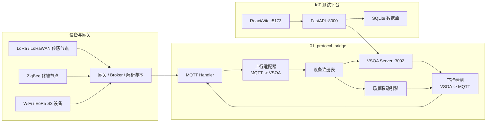

# 南航 - ACOINFO 项目制实习物联网综合项目

本仓库是南京航空航天大学与南京翼辉信息技术有限公司（ACOINFO）项目制实习中的物联网综合实践仓库，围绕 LoRa/LoRaWAN、ZigBee、与MQTT到VSOA桥接转换完成端到端数据接入、协议转换、设备控制、链路监测和场景联动验证。

项目不是单一脚本集合，而是一条完整的物联网联调链路：

```text
LoRa / LoRaWAN / ZigBee / WiFi 设备
        ↓
MQTT Broker / 网关解析程序
        ↓
MQTT ↔ VSOA 协议桥接组件
        ↓
VSOA 业务服务 / 下行控制 / 场景联动
        ↓
IoT 测试平台可视化、审计和验证
```

## 项目亮点

- 支持 LoRa、LoRaWAN、ZigBee、WiFi 多类设备接入。
- 实现 MQTT 到 VSOA 的上行数据转换，以及 VSOA 到 MQTT 的下行控制。
- 内置设备注册表、幂等去重、traceId 链路追踪和多 Broker 路由。
- 支持 LoRaWAN HCv3 摄像头图片分片重组。
- 支持 ZigBee Ebyte 网关原始帧解析、下行帧构造和链路质量统计。
- 提供 FastAPI + React/Vite IoT 测试平台，用于设备状态、消息追踪、告警、场景联动和运维诊断。
- 提供 pytest 自动化测试、端到端验证脚本、MQTT/VSOA 调试工具和 Linux systemd 部署配置。

## 仓库结构

```text
nuaa_acoinfo_iot_internship_repo/
├── 01_protocol_bridge/                 # MQTT ↔ VSOA 桥接组件与 IoT 测试平台
│   ├── src/                             # 桥接主程序、上行、下行、场景引擎
│   ├── vsoa/                            # 内置 VSOA Python SDK
│   ├── iot_test_platform/               # FastAPI + React/Vite 测试平台
│   ├── tools/                           # 模拟设备、下行命令、端到端验证等工具
│   ├── tests/                           # 自动化测试
│   ├── config.yaml                      # 桥接统一配置
│   ├── scenes.yaml                      # 场景联动规则
│   ├── bridge.service                   # Linux systemd 服务示例
│   ├── zigbee_bridge.py                 # ZigBee Ebyte 原始帧 ↔ JSON 双向桥接
│   └── README.md                        # 协议桥接项目详细说明
├── 02_LoRaWan/                          # LoRaWAN 网关、本地解析和下行转换脚本
│   ├── 网关Linux/                       # 网关侧 MQTT 解析、Topic 转换和 systemd 服务
│   ├── 本地解析程序/                    # 本地传感数据/图片接收解析程序
│   └── Eora_hub/                        # EoRa/S3 相关辅助脚本
├── 03_zigbee/                           # ZigBee 网关解析、板载代码和压力测试
│   ├── MQTT上下行解析/                  # MQTT 原生 ZigBee 上下行解析链路
│   └── ZigBee板载与压力测试代码_20260730/
│       ├── 板载代码/                    # CC2530 SampleSwitch 源码、IAR 工程和 HEX 固件
│       └── 压力测试代码/                # TCP 带宽测试脚本与示例结果
├── .gitignore
└── README.md                            # 仓库总入口
```

## 系统架构


```mermaid
flowchart LR
    subgraph Devices["设备与网关"]
        Lora["LoRa / LoRaWAN 传感节点"]
        Zigbee["ZigBee 终端节点"]
        Wifi["WiFi / EoRa S3 设备"]
        Gateway["网关 / Broker / 解析脚本"]
    end

    subgraph Bridge["01_protocol_bridge"]
        MQTT["MQTT Handler"]
        Uplink["上行适配器\nMQTT -> VSOA"]
        Registry["设备注册表"]
        Downlink["下行控制\nVSOA -> MQTT"]
        Scene["场景联动引擎"]
        VSOA["VSOA Server :3002"]
    end

    subgraph Platform["IoT 测试平台"]
        API["FastAPI :8000"]
        Web["React/Vite :5173"]
        DB["SQLite 数据库"]
    end

    Lora --> Gateway
    Zigbee --> Gateway
    Wifi --> Gateway
    Gateway --> MQTT
    MQTT --> Uplink
    Uplink --> Registry
    Registry --> VSOA
    VSOA --> Downlink
    Registry --> Scene
    Scene --> Downlink
    Downlink --> MQTT
    API --> VSOA
    API --> DB
    Web --> API
```

## 核心模块说明

| 模块 | 路径 | 作用 |
| --- | --- | --- |
| MQTT ↔ VSOA 桥接 | `01_protocol_bridge/src/` | 统一启动上行、下行、场景引擎、VSOA RPC 与 MQTT 路由 |
| 上行适配器 | `01_protocol_bridge/src/uplink/adapters/` | 将 LoRa、ZigBee、WiFi、Generic 数据归一化为设备上报模型 |
| 下行控制 | `01_protocol_bridge/src/downlink/` | 校验 VSOA 控制命令，去重后发布到 MQTT 下行 Topic |
| 场景引擎 | `01_protocol_bridge/src/scene_engine/` | 根据传感器条件触发自动控制，支持冷却、边沿触发和自动停止 |
| ZigBee 双向桥接 | `01_protocol_bridge/zigbee_bridge.py` | 解析 Ebyte 网关原始帧并转换为 JSON，同时将控制命令转回下行帧 |
| IoT 测试平台 | `01_protocol_bridge/iot_test_platform/` | Web 页面展示设备、消息、告警、拓扑、场景和审计记录 |
| LoRaWAN 网关脚本 | `02_LoRaWan/网关Linux/` | 网关侧传感数据解析、S3 下行转换、MQTT Topic 转换和服务化运行 |
| ZigBee MQTT 解析 | `03_zigbee/MQTT上下行解析/` | 使用 ZigBee 网关内置 MQTT 完成上行解析、下行控制和链路监控 |
| ZigBee 板载与压测 | `03_zigbee/ZigBee板载与压力测试代码_20260730/` | CC2530 板载代码、HEX 固件、IAR 工程、带宽统计脚本和示例结果 |

## 数据链路

### 上行流程

1. LoRa/LoRaWAN、ZigBee 或 WiFi 设备采集数据。
2. 网关或解析脚本将数据发布到 MQTT Topic，例如：
   - `bridge/uplink/lora/+/data`
   - `bridge/uplink/zigbee/+/data`
   - `bridge/uplink/generic/+/data`
3. 桥接组件按设备类型选择 adapter，提取 `device_id`、`device_type` 和传感器字段。
4. 数据写入设备注册表，并通过 VSOA 查询端点和事件发布给上层服务。
5. IoT 测试平台展示设备状态、历史数据、告警和消息追踪。

### 下行流程

1. VSOA RPC 或 Pub/Sub 发送控制命令。
2. 桥接组件校验设备、命令、超时与幂等 ID。
3. 命令转换为 MQTT 下行消息并发布到目标设备 Topic。
4. ZigBee、LoRaWAN 或 Generic 下行转换脚本继续转为真实网关/设备可识别格式。
5. 平台记录 ACK、超时、失败原因和操作审计。

## 环境要求

| 类型 | 建议版本 | 用途 |
| --- | --- | --- |
| Python | 3.8.10+，推荐 3.12+ | 桥接组件、脚本、测试平台后端 |
| Node.js | 20+ | 测试平台前端 |
| pnpm | 通过 `corepack` 启用 | 前端依赖管理 |
| MQTT Broker | EMQX、Mosquitto 或现场 Broker | 设备上行和控制下行 |
| PowerShell | Windows 10/11 自带即可 | 一键启动脚本 |
| IAR Embedded Workbench | 与 CC2530/Z-Stack 工程匹配 | ZigBee 板载工程编译 |

桥接组件依赖文件：

```text
01_protocol_bridge/requirements-py38.txt
01_protocol_bridge/iot_test_platform/backend/requirements.txt
01_protocol_bridge/iot_test_platform/frontend/package.json
```

## 快速开始

### 1. 克隆仓库

```bash
git clone https://github.com/ljx000123/nuaa_acoinfo_iot_internship_repo.git
cd nuaa_acoinfo_iot_internship_repo
```

### 2. 安装桥接组件依赖

```powershell
cd 01_protocol_bridge
python -m venv .venv
.\.venv\Scripts\Activate.ps1
python -m pip install --upgrade pip
python -m pip install -r requirements-py38.txt
```

说明：VSOA Python SDK 已内置在 `01_protocol_bridge/vsoa/`，桥接主服务应从 `01_protocol_bridge/` 目录启动，以确保优先加载仓库内置 SDK。

### 3. 修改配置

主要配置文件为：

```text
01_protocol_bridge/config.yaml
```

常用配置项：

| 配置段 | 说明 |
| --- | --- |
| `vsoa.server` | 桥接组件内置 VSOA Server，默认 `0.0.0.0:3002` |
| `vsoa.business_server` | 业务层 VSOA Server，默认 `0.0.0.0:3000` |
| `mqtt.broker` | 主 MQTT Broker，默认用于 LoRa/Generic |
| `mqtt.project_brokers.zigbee` | ZigBee 独立 Broker 路由 |
| `mqtt.uplink_topics` | 桥接订阅的上行 Topic |
| `downlink.command` | 下行命令超时、重试和幂等去重 |
| `chirpstack` | LoRaWAN ChirpStack 下行格式 |
| `scene_engine` | 场景联动规则文件、冷却期和规则数量限制 |

请根据现场网络修改 MQTT Broker IP、端口、Topic、VSOA 对外地址和 ChirpStack 参数。不要提交真实密码、Token、个人账号或仅在本机有效的绝对路径。

### 4. 启动桥接主服务

```powershell
cd 01_protocol_bridge
python src/main.py --config config.yaml
```

可选启动方式：

```powershell
# 离线模式，不连接 MQTT Broker
python src/main.py --config config.yaml --no-mqtt

# 仅运行上行，不启动 Pub/Sub 下行监听
python src/main.py --config config.yaml --uplink-only

# 临时覆盖 MQTT Broker
python src/main.py --config config.yaml --mqtt-broker 192.168.200.221 --mqtt-port 1883
```

启动成功后，桥接组件会提供：

| 端口 | 协议 | 用途 |
| --- | --- | --- |
| `3002` | VSOA | 上行查询、下行 RPC、ACK/事件发布、场景管理 |
| `3000` | VSOA | 业务层 VSOA Server，订阅 `/ctrl/cmd` |
| `1883` | MQTT | 连接外部 Broker，订阅上行并发布下行 |
| `9090` | TCP | JSON Lines 注入，便于离线测试 |

## ZigBee 链路使用

### MQTT 原生网关链路

目录：

```text
03_zigbee/MQTT上下行解析/
```

启动顺序：

```powershell
cd 03_zigbee\MQTT上下行解析

# 终端 1：上行解析，原始 HEX 帧 -> JSON
python mqtt_bridge.py

# 终端 2：下行控制，JSON 命令 -> HEX 帧
python mqtt_downlink.py

# 终端 3：链路质量监控
python link_monitor.py
```

核心 Topic：

| Topic | 方向 | 说明 |
| --- | --- | --- |
| `zigbee/gw/uplink` | 网关 -> Broker | ZigBee 网关发布原始 HEX 帧 |
| `zigbee/gw/downlink` | Broker -> 网关 | 下行 HEX 控制帧 |
| `bridge/uplink/zigbee/+/data` | 解析脚本 -> 应用 | 传感器 JSON 数据 |
| `bridge/uplink/zigbee/+/status` | 监控脚本 -> 应用 | 链路状态和质量统计 |
| `bridge/downlink/zigbee/+/set` | 应用 -> 解析脚本 | JSON 控制命令 |

### 板载代码与压力测试

目录：

```text
03_zigbee/ZigBee板载与压力测试代码_20260730/
```

内容包括：

- CC2530 `SampleSwitch` 应用层源码。
- IAR 工程文件。
- 可直接烧录的 HEX 固件。
- `zigbee_bandwidth_tester.py` 带宽测试脚本。
- CSV 逐帧记录和 JSON 汇总示例。

压力测试示例：

```powershell
cd 03_zigbee\ZigBee板载与压力测试代码_20260730\压力测试代码
python zigbee_bandwidth_tester.py `
  --host 192.168.3.7 `
  --port 8887 `
  --expected-short 0xB25B `
  --duration 600
```

示例测试结果显示，在目标短地址 `0xB25B`、有效测试帧 2623 帧的记录中，档位 0-6 未观察到丢帧、重复、乱序或协议栈拒绝；最大稳定档位为 10 ms 周期，实际接收帧率约 21.276 帧/秒。

## LoRaWAN 链路使用

目录：

```text
02_LoRaWan/
```

主要脚本：

| 文件 | 作用 |
| --- | --- |
| `网关Linux/sensor_receiver.py` | 订阅 LoRaWAN/WiFi MQTT 数据，解析 S3 传感 payload |
| `网关Linux/s3_downlink_converter.py` | 将上层 JSON 控制命令转换为 ChirpStack/LoRaWAN 下行 payload |
| `网关Linux/mqtt_topic_converter.py` | MQTT Topic 转换 |
| `网关Linux/*.service` | Linux systemd 服务示例 |
| `本地解析程序/sensor_receiver.py` | 本地传感数据接收解析 |
| `本地解析程序/image_receiver.py` | 本地图片接收解析 |

S3 LoRaWAN 传感 payload 解析覆盖字段包括：

- 序列号、启动 ID、发送时间、重传计数。
- 温度、空气湿度、土壤湿度、降水量。
- 电机状态、舵机角度、LED 状态。
- 信号强度和下行命令执行结果。

下行控制转换支持将 `led`、`motor`、`servo` 等 JSON 命令编码为 LoRa payload，并发布到对应 ChirpStack 下行 Topic。

## IoT 测试平台

目录：

```text
01_protocol_bridge/iot_test_platform/
```

功能包括：

- 设备中心：按 LoRa、ZigBee、WiFi 聚合设备。
- 实时数据：展示温度、湿度、电压、烟雾、人体红外、信号、电量、图片帧等。
- 消息追踪：保留 MQTT 原始消息和桥接结果。
- 链路转换：展示设备、Broker、桥接和 VSOA 之间的拓扑关系。
- 告警中心：温度、电量、烟雾等告警与人工确认。
- 场景联动：AND/OR 条件匹配后批量下发设备控制。
- 下行控制：二次确认、ACK/超时状态和操作审计。
- 权限系统：`user`、`tester`、`admin` 三种角色。
- 深色/浅色主题和浏览器偏好保存。

### 安装平台依赖

```powershell
cd 01_protocol_bridge\iot_test_platform
python -m pip install -r backend\requirements.txt
corepack enable
corepack pnpm --dir frontend install
```

### 一键启动

```powershell
cd 01_protocol_bridge\iot_test_platform
.\start_platform.ps1
```

启动后访问：

- 本机：`http://127.0.0.1:5173`
- 局域网：`http://本机局域网IP:5173`

默认账号：

| 角色 | 用户名 | 初始密码 |
| --- | --- | --- |
| 普通用户 | `user` | `user123` |
| 测试运维员 | `tester` | `tester123` |
| 管理员 | `admin` | `admin123` |

正式联调前建议使用管理员账号修改默认密码。

## 自动化测试

测试目录：

```text
01_protocol_bridge/tests/
```

运行方式：

```powershell
cd 01_protocol_bridge

# 全部测试
python -m pytest tests/ -v

# 按模块运行
python -m pytest tests/downlink/ -v
python -m pytest tests/uplink/ -v
python -m pytest tests/platform/ -v
python -m pytest tests/scene_engine/ -v

# Python 3.8 兼容性冒烟测试
python tools/python38_smoke.py
```

测试覆盖：

- 下行命令校验、ACK 构造、幂等去重、RPC/PubSub 集成。
- 上行 adapter、设备注册表、LoRaWAN 图片分片重组。
- MQTT 多 Broker 路由。
- 场景引擎条件匹配、触发、冷却和自动停止。
- IoT 测试平台环境仪表盘、阈值告警和 LoRa 控制。

## 开发与调试工具

目录：

```text
01_protocol_bridge/tools/
```

| 工具 | 用途 |
| --- | --- |
| `sim_device.py` | 模拟 LoRa/ZigBee 设备上报 |
| `send_downlink.py` | 手动发送下行命令 |
| `verify_e2e.py` | 自动化端到端验证 |
| `mqtt_monitor.py` | CLI MQTT 消息监视器 |
| `mqtt_test.py` | MQTT Broker 连接测试 |
| `vsoa_monitor.py` | VSOA 事件订阅监视 |
| `start_terminals.ps1` | 一键打开多个开发终端 |
| `python38_smoke.py` | Python 3.8 兼容性检查 |

端到端验证建议启动 4 个终端：

```powershell
# 终端 1：桥接主服务
python src/main.py --config config.yaml

# 终端 2：MQTT 监控
python tools/mqtt_monitor.py

# 终端 3：模拟设备
python tools/sim_device.py

# 终端 4：端到端验证
python tools/verify_e2e.py
```

## Linux 部署

`01_protocol_bridge/bridge.service` 提供 systemd 示例，可用于 LoRaWAN 网关或 Linux 主机开机自启。

示例流程：

```bash
cd /root/01_protocol_bridge
python3 -m pip install -r requirements-py38.txt

sudo cp bridge.service /etc/systemd/system/bridge.service
sudo systemctl daemon-reload
sudo systemctl start bridge
sudo systemctl enable bridge
```

常用命令：

```bash
sudo systemctl status bridge
sudo journalctl -u bridge -f
sudo systemctl restart bridge
sudo systemctl stop bridge
```

如果目标主机没有 Docker，请检查 `bridge.service` 中是否存在 `Requires=docker.service`，按实际环境删除或调整。

## 配置与数据安全

- `config.yaml` 中的 Broker 地址、VSOA 地址、Topic 和 ChirpStack 参数需要按现场环境修改。
- 不要提交真实密码、Token、密钥、个人账号、数据库文件和本机绝对路径。
- IoT 测试平台数据默认保存在 `01_protocol_bridge/iot_test_platform/data/platform.db`，该数据库包含账号哈希、设备数据和审计记录，应保持在 `.gitignore` 中。
- 平台启动和正常关闭时会在 `data/backups/` 中保留 SQLite 备份。

## 常见问题

### 启动桥接时报 `No module named 'vsoa'`

请从 `01_protocol_bridge/` 目录启动：

```powershell
cd 01_protocol_bridge
python src/main.py --config config.yaml
```

不要在其他目录直接运行 `src/main.py`，否则可能无法优先加载仓库内置 `vsoa/`。

### MQTT 连接失败

检查：

- `config.yaml` 中 Broker IP 和端口是否正确。
- 当前电脑或网关是否能访问 Broker。
- EMQX/Mosquitto 是否已启动。
- 账号密码、QoS 和 Topic 是否与现场配置一致。

### 下行命令提示设备不存在

设备需要先有至少一次上行数据，写入设备注册表后才能被下行控制。请先确认目标设备在 `bridge/uplink/.../data` 上报过数据。

### IoT 平台页面能打开但没有数据

检查：

- 是否已登录平台。
- `01_protocol_bridge/src/main.py` 是否正在运行。
- MQTT Broker 是否有真实设备或模拟设备数据。
- 后端 `8000` 端口是否启动。
- 前端访问地址和后端是否在同一台机器上。

### 局域网其他电脑访问不了平台

请确认：

- 使用 `start_platform.ps1` 启动，或手动添加 `--host 0.0.0.0`。
- Windows 防火墙放行 TCP `5173` 和 `8000`。
- 其他电脑访问的是本机真实局域网 IP，而不是 `127.0.0.1`。

### Git 更新后接口异常或页面 404

旧后端进程可能仍在运行旧代码。可先查找并停止占用端口的进程，再重新启动平台：

```powershell
netstat -ano | findstr ":8000.*LISTENING"
taskkill /PID <PID> /F
cd 01_protocol_bridge\iot_test_platform
.\start_platform.ps1
```

## 推荐联调顺序

1. 启动 MQTT Broker，并确认 Broker 网络可达。
2. 启动 ZigBee 或 LoRaWAN 网关侧解析/转换脚本。
3. 启动 `01_protocol_bridge/src/main.py`。
4. 使用 `tools/mqtt_monitor.py` 或 MQTTX 观察上行 Topic。
5. 启动 IoT 测试平台。
6. 使用模拟设备或真实设备验证上行数据。
7. 使用平台或 `tools/send_downlink.py` 验证下行控制。
8. 运行 `tools/verify_e2e.py` 和 pytest 测试，保存日志和结果。

## 项目状态

| 能力 | 状态 |
| --- | --- |
| MQTT -> VSOA 上行桥接 | 已实现 |
| VSOA -> MQTT 下行控制 | 已实现 |
| RPC 与 Pub/Sub 双通道下行 | 已实现 |
| 多 Broker 路由 | 已实现 |
| 设备注册表 | 已实现 |
| 幂等去重 | 已实现 |
| traceId 链路追踪 | 已实现 |
| 场景联动引擎 | 已实现 |
| IoT 测试平台 | 已实现 |
| LoRaWAN HCv3 图片分片重组 | 已实现 |
| ZigBee MQTT 上下行解析 | 已实现 |
| ZigBee 板载带宽测试 | 已实现并包含示例结果 |

## 相关文档入口

- `01_protocol_bridge/README.md`：MQTT ↔ VSOA 桥接组件详细说明。
- `01_protocol_bridge/src/README.md`：桥接源码架构说明。
- `01_protocol_bridge/tools/README.md`：调试工具说明。
- `01_protocol_bridge/tests/README.md`：测试套件说明。
- `01_protocol_bridge/iot_test_platform/README.md`：IoT 测试平台说明。
- `01_protocol_bridge/iot_test_platform/docs/product_scope.md`：平台产品范围。
- `01_protocol_bridge/iot_test_platform/docs/device_integration_contract.md`：设备统一接入约定。
- `03_zigbee/MQTT上下行解析/README.md`：ZigBee MQTT 原生链路说明。
- `03_zigbee/ZigBee板载与压力测试代码_20260730/README.md`：ZigBee 板载代码与压力测试总结。

## 维护建议

- 顶层 README 只描述全局架构、启动顺序和模块入口。
- 具体脚本参数、网关 IP、设备短地址、测试结果应写入对应子目录 README。
- 修改 Topic、payload 或 VSOA 接口后，同步更新 `config.yaml`、设备接入约定和端到端验证脚本。
- 新增设备类型时优先扩展 `src/uplink/adapters/`，保持桥接主流程稳定。
- 新增平台功能时同步补充 `tests/platform/` 测试用例。
- 所有演示、验收和联调结果建议保留命令、日志、截图和测试日期，保证可复现。
